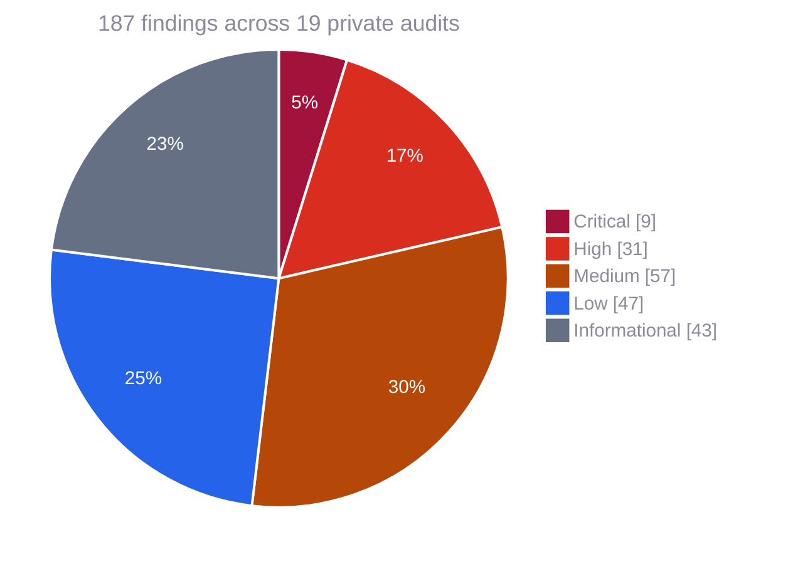
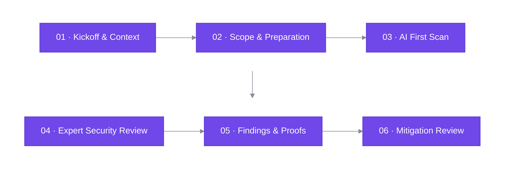

<a href="https://kannaudits.com">
  <picture>
    <source media="(prefers-color-scheme: dark)" srcset="assets/kann-audits-dark.svg">
    
  </picture>
</a>

<h3>Web3 Security Audits</h3>

Kann Audits is a Web3 security audit company helping DeFi protocols, blockchain networks, and infrastructure teams build securely at every stage, from development to launch and beyond.

<b>Solidity &nbsp;·&nbsp; Rust &nbsp;·&nbsp; Move &nbsp;·&nbsp; Go &nbsp;·&nbsp; Circom &nbsp;·&nbsp; ZK &nbsp;·&nbsp; Off-Chain Infrastructure</b>

  

<table>
  <tr>
    <td align="center" width="190"><h2>61</h2>PRIVATE AUDIT REPORTS</td>
    <td align="center" width="190"><h2>187</h2>FINDINGS REPORTED</td>
    <td align="center" width="190"><h2>350</h2>VULNERABILITIES FOUND</td>
  </tr>
</table>

## Private security audits

**Severity key** &nbsp;&nbsp;&nbsp;
 Critical &nbsp;&nbsp;&nbsp;
 High &nbsp;&nbsp;&nbsp;
 Medium &nbsp;&nbsp;&nbsp;
 Low &nbsp;&nbsp;&nbsp;
 Informational

### 2026 &nbsp;·&nbsp; 9 reports

| Protocol | Type | Findings | Date | Report |
|:--|:--|:--|:--|:--|
| **IZKONEN** | Tokenomics |   | August 2026 |   |
| **N4A** | Bug Bounty Program |     | July 2026 |   |
| **Fluton** | Privacy Lending |      | June 2026 |   |
| **Mystic Finance** | Liquid Staking |    | May 2026 |   |
| **Arche** | Yield Aggregator |  | May 2026 |   |
| **castr.fun** | Token Launchpad |      | April 2026 |   |
| **APTree** | Yield Aggregator | – | April 2026 |  |
| **HyperLend** | Leveraged Lending |   | April 2026 |   |
| **Mystic Finance** | DEX |  | February 2026 |   |
| **Encifher** | Privacy Bridging |   | February 2026 |   |

### 2025 &nbsp;·&nbsp; 10 reports

| Protocol | Type | Findings | Date | Report |
|:--|:--|:--|:--|:--|
| **Mystic Finance** | Liquid Staking |    | December 2025 |   |
| **Gluon** | Yield Aggregator |   | September 2025 |   |
| **Manifest Finance** | RWA |      | August 2025 |   |
| **Wild Protocol** | Launchpad |     | June 2025 |   |
| **Mystic Finance** | RWA |   | June 2025 |   |
| **Mystic Finance** | RWA |    | June 2025 |   |
| **FactcheckDotFun** | Derivatives |   | May 2025 |   |
| **Pulse In Private** | DeFi Privacy |  | April 2025 |   |
| **Pulse In Private** | DeFi Privacy |  | March 2025 |   |
| **RWA** | Borrowing & Lending |    | January 2025 |   |

## Findings by severity

|  |  |  |  |  |
|:-:|:-:|:-:|:-:|:-:|
| **9** | **31** | **57** | **47** | **43** |

## How we work

| Step | What happens |
|:--|:--|
| **01 · Kickoff & Context** | A kickoff call to understand architecture, trust boundaries, threat assumptions and intended behaviour. |
| **02 · Scope & Preparation** | Confirm the commit, files in scope, dependencies and the riskiest areas. We open a private channel between your team and our auditors. |
| **03 · AI First Scan** | Kann AI, our proprietary model built to find security bugs, scans the codebase before the manual review starts. |
| **04 · Expert Security Review** | Line-by-line analysis of exploit paths, invariant breaks, edge cases, accounting and integration risks. |
| **05 · Findings & Proofs** | Each issue is confirmed, rated and backed by a proof of concept or a precise reproduction path. |
| **06 · Mitigation Review** | We review every fix, confirm it resolves the root cause and flag partial or incorrect mitigations. |

## Report formats

Every report is published in two formats:

- **PDF**: the full report with scope, methodology, risk classification and findings, in [`reports/pdf-format`](reports/pdf-format)
- **Markdown**: every finding as plain text, in [`reports/md-format`](reports/md-format)

 

### Request a security audit

© Kann Audits

